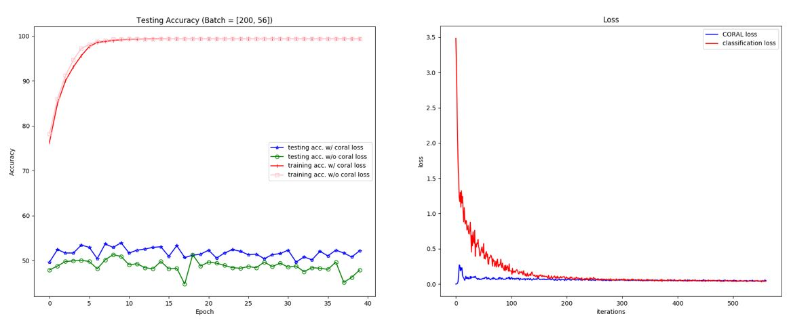

# Deep CORAL

A PyTorch implementation of 'Deep CORAL: Correlation Alignment for Deep Domain Adaptation. B Sun, K Saenko, ECCV 2016'

> Deep CORAL can learn a nonlinear transformation that aligns correlations of
layer activations in deep neural networks (Deep CORAL).

[中文介紹](https://ssarcandy.tw/2017/10/31/deep-coral/)

My implementation result (Task Amazon -> Webcam):



## Requirement

- Python 3
- PyTorch 0.2

## Usage

1. Unzip dataset in `dataset/office31.tar.gz`
2. Run `python3 main.py`

## Unit Test

The unit test is for sanity test only (to check my math is not going wrong),
please run it under CPU version of PyTorch.

```bash
$ cd ..
$ python -m DeepCORAL.tests.test -v
test_CORAL_backward (__main__.TestCORAL) ... ok
test_CORAL_forward (__main__.TestCORAL) ... ok
test_feature_covariance_mat (__main__.TestCORAL) ... ok
test_forbenius_norm (__main__.TestCORAL) ... ok

----------------------------------------------------------------------
Ran 4 tests in 0.033s

OK
```
